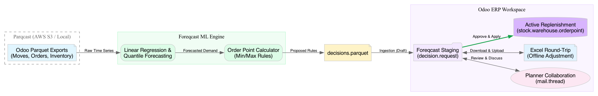
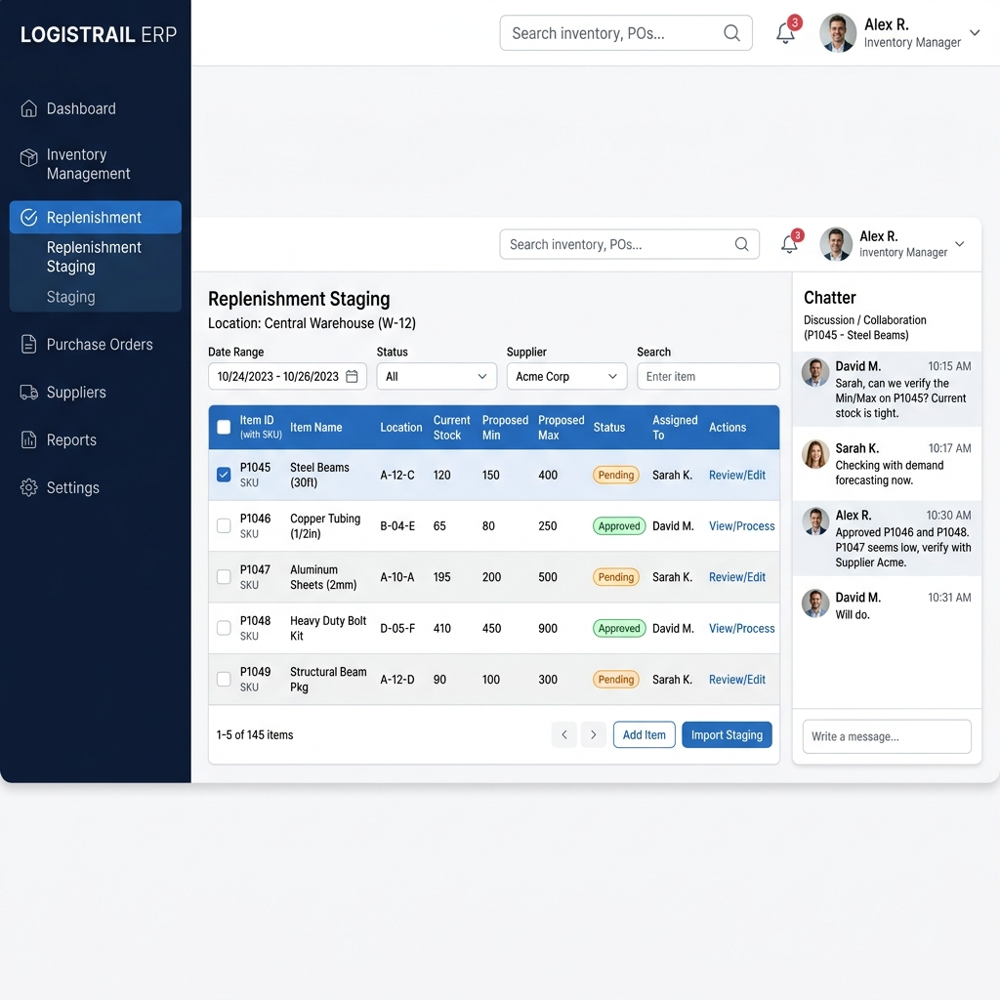

# Foreqcast Planner Guide

Welcome to the **Foreqcast Collaborative Replenishment Workspace**. 
Foreqcast is a predictive demand engine that bridges the gap between raw historical data and actionable inventory operations. Rather than blindly applying automated rules, the system acts as your intelligent co-pilot, generating data-driven proposals for your review.

This guide will walk you through the collaborative workflow, explaining how to interact with AI-proposed replenishment quantities, override logic, and push final decisions into Odoo.

---

## 1. The Collaborative Architecture

Foreqcast operates via a sequential pipeline designed to provide full transparency into how a recommendation was generated.

1. **Parqcast Exports**: Your Odoo data (sales, moves, inventory) is exported periodically.
2. **Foreqcast ML Engine**: Computes linear regressions, trends, and safety stocks.
3. **Staging (Decisions)**: Proposals enter the Odoo ERP workspace as "Staged Requests."
4. **Human-in-the-Loop**: You use Chatter or Excel to adjust the proposals.
5. **Approval**: Staged requests are merged into active `stock.warehouse.orderpoint` rules.

---

## 2. Reviewing Staged Decisions in Odoo

When the pipeline completes a run, the resulting proposals do not immediately affect production inventory. Instead, they are routed to the **Replenishment Staging** dashboard.

### The Staging Interface
- **Status Badges**: Proposals start as `Pending`. Once you verify the min/max quantities, you mark them as `Approved`.
- **Chatter Integration**: On the right-hand side of any decision, you can leave comments, tag colleagues (e.g., `"@David, can we verify the Min/Max on P1045? Stock is tight."`), and log an audit trail of *why* a number was changed.
- **Overrides**: If the AI forecast is consistently overestimating demand for a specific product category, you can set a **Safety Factor Override** right from the interface. Subsequent pipeline runs will respect this constraint.

### Handling New Products (Insufficient History)
Foreqcast requires a certain amount of historical data to generate reliable forecasts (configurable via the **Minimum History Days** setting, which defaults to 36 days). 
If a product is too new, Foreqcast will not simply skip it. Instead, you can define **Default Min/Max Policies**:
- **Global Fallbacks**: Set default quantities (e.g., Min 0, Max 0) in the Foreqcast Settings.
- **Category Overrides**: Set category-specific fallbacks (e.g., all new "Laptops" default to Min 2, Max 5).
Products using these fallback rules will appear in your Staging Dashboard alongside normal forecasts, allowing you to manually review and approve baseline stock levels for new items!

---

## 3. The Excel "Round-Trip" Workflow

We understand that for bulk reviews or complex spreadsheet modeling, Excel is often the preferred tool. Foreqcast features a robust "Round-Trip" capability.

### Step-by-Step Excel Collaboration:
1. **Download**: From the Staging dashboard, click **Download Excel**.
2. **Review**: Open the file. The `Review` sheet provides human-readable context:
   - Historical Demand & Trend Slopes
   - Inventory Flags (e.g., `Ok`, `Overstock`, `At Risk`)
   - **Planned Lead Time** vs. **Empirical Lead Time** (how long shipments actually take).
3. **Adjust**: Modify the `product_min_qty` and `product_max_qty` columns as needed based on your intuition or vendor discussions.
4. **Upload**: Navigate to the **Excel Upload Wizard** in Odoo and select your modified file. The system will use embedded Decision IDs to map your changes perfectly back to the pending staging requests.

> [!TIP]
> **Trust the Empirical Data:** When available, Foreqcast prioritizes *Empirical Lead Time* (the actual historical duration from PO creation to receipt) over the *Planned Lead Time* (the vendor's advertised duration). If you notice discrepancies, it means your vendors are delivering slower than promised!

---

## Ready to Push?
Once you are satisfied with the staged quantities—whether edited via the Odoo UI or Excel—simply highlight the rows and click **Approve & Apply**. The quantities will instantly become active `stock.warehouse.orderpoint` rules, guiding Odoo's native reordering operations.
